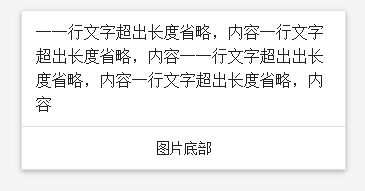
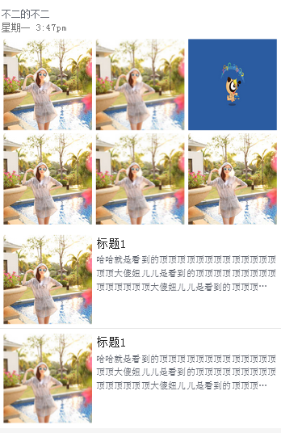
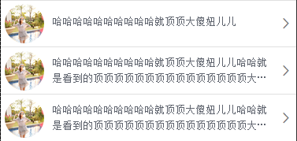
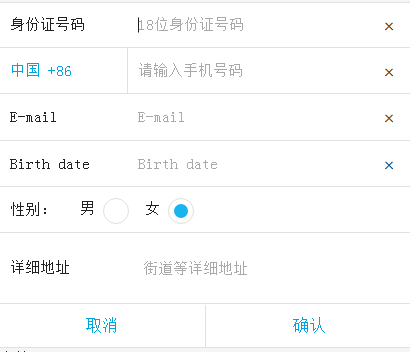
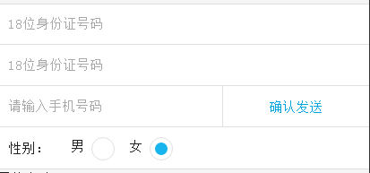
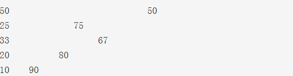

# d-ui

<div class="box" style="position: fixed;
    height: 40px;
    line-height: 20px;">
<a href="#btn" style="padding: 10px;
    border: 1px solid;
    display: inline-block;
    margin-right: 10px;">按钮</a>
<a href="#border" style="padding: 10px;
    border: 1px solid;
    display: inline-block;
    margin: 5px;">边框</a>
<a href="#avatar"style="padding: 10px;
    border: 1px solid;
    display: inline-block;
    margin-right: 10px;">头像</a>
<a href="#card"style="padding: 10px;
    border: 1px solid;
    display: inline-block;
    margin-right: 10px;">卡片</a>
<a href="#label"style="padding: 10px;
    border: 1px solid;
    display: inline-block;
    margin-right: 10px;">标签</a>
<a href="#progress"style="padding: 10px;
    border: 1px solid;
    display: inline-block;
    margin-right: 10px;">进度条</a>
<a href="#header"style="padding: 10px;
    border: 1px solid;
    display: inline-block;
    margin-right: 10px;">标题栏</a>
<a href="#header-b"style="padding: 10px;
    border: 1px solid;
    display: inline-block;
    margin-right: 10px;">底部工具栏</a>
<a href="#list"style="padding: 10px;
    border: 1px solid;
    display: inline-block;
    margin-right: 10px;">列表</a>
<a href="#tag"style="padding: 10px;
    border: 1px solid;
    display: inline-block;
    margin-right: 10px;">角标</a>
<a href="#shadow"style="padding: 10px;
    border: 1px solid;
    display: inline-block;
    margin-right: 10px;">阴影</a>
<a href="#search"style="padding: 10px;
    border: 1px solid;
    display: inline-block;
    margin-right: 10px;">搜索框</a>
    <br>
<a href="#loading"style="padding: 10px;
    border: 1px solid;
    display: inline-block;
    margin-right: 10px;">loading</a>
<a href="#dialog"style="padding: 10px;
    border: 1px solid;
    display: inline-block;
    margin-right: 10px;">dialog</a>
<a href="#form"style="padding: 10px;
    border: 1px solid;
    display: inline-block;
    margin-right: 10px;">表单</a>
<a href="#nowrap"style="padding: 10px;
    border: 1px solid;
    display: inline-block;
    margin-right: 10px;">文字截断</a>
<a href="#justify"style="padding: 10px;
border: 1px solid;
display: inline-block;
margin-right: 10px;">两端对齐</a>
<a href="#placehold"style="padding: 10px;
border: 1px solid;
display: inline-block;
margin-right: 10px;">占位符</a>
<a href="#tab"style="padding: 10px;
border: 1px solid;
display: inline-block;
margin-right: 10px;">标签页</a>
<a href="#grid"style="padding: 10px;
border: 1px solid;
display: inline-block;
margin-right: 10px;">栅格</a>
<a href="#txt"style="padding: 10px;
border: 1px solid;
display: inline-block;
margin-right: 10px;">文本样式</a>
</div>
<div style="margin-top:150px"></div>
####按钮
<div id="btn"></div>
 尺寸:可以通过给button加上类d-btn(常规按钮),d-btn-s(小按钮),d-btn-lg(大按钮)
 颜色:可以通过给button加上类d-btn-primary,d-btn-danger
 

````html
<button class="d-btn"> 按钮</button>
<button class="d-btn d-btn-primary"> 按钮</button> 
<button class="d-btn d-btn-danger"> 按钮</button>  
<button class="d-btn-s">确认</button> 
<button class="d-btn-s d-btn-primary">确认</button> 
<button class="d-btn-s d-btn-danger">确认</button>
<button class="d-btn-lg">确认</button> 
<button class="d-btn-lg d-btn-primary">确认</button> 
<button class="d-btn-lg d-btn-danger">确认</button> 

````
####1PX边框
<div id="border"></div>
只需要添加边框类即可:
.d-border-t(上边框).d-border(边框).d-border-b(下边框).d-border-tb(下边框) .d-border-l(左边框).d-border-r(右边框)

````html
<ul>
    <li class="d-border-t">上边框</li>
    <li class="d-border">边框</li>
    <li class="d-border-b">下边框</li>
    <li class="d-border-tb">上下边框</li>
    <li class="d-border-l">左边框</li>
    <li class="d-border-r">右边框</li>
</ul>
````
####头像
<div id="avatar"></div>
.d-avatar-50(定义长宽为50px的头像).d-avatar-80(定义长宽为80px的头像)
.d-avatar-100(定义长宽为100px的头像).d-avatar-120(定义长宽为120px的头像)

````html
<div class="d-avatar-50">
    <span style="background-image:url(t1.jpg)"></span>
</div>
<div class="d-avatar-80">
    <span style="background-image:url(t1.jpg)"></span>
</div>
<div class="d-avatar-100">
    <span style="background-image:url(t1.jpg)"></span>
</div>
<div class="d-avatar-120">
    <span style="background-image:url(t1.jpg)"></span>
</div>
````
###卡片
<div id="card"></div>
伴随着列表视图，卡片是一种很好的方法来控制和组织你的信息。卡片含有独特的相关数据，例如，照片，文字和所有关于一个主题的链接。卡片通常是更复杂的和详细的信息的一个切入点

.d-col-md--3表示栅格类，表示屏幕大于992px时，占屏幕宽度的1/4

.d-shadow-2  边上阴影，后面的数字便是阴影程度，数字越大，阴影越大，数字从1到5

.d-border 表示边框；
.d-border-t表示上边框；
.d-content表示卡片的中心内容区域
.d-card-footer表示卡片的底部
####简单卡片

````html
<div class="container">
    <div class="d-row">
      <div class="d-col-md-3">
           <div class="d-card-list d-border d-shadow-1" >
                <div class="d-card-content">一一行文字超出长度省略，内容一行文字超出长度省略，内容一一行文字超出出长度省略，内容一行文字超出长度省略，内容</div>
                <div class="d-card-footer d-border-t d-text-align-c"><p>图片底部</p></div>
           </div>
       </div>
    </div>
</div>  
````
###风格卡片
.d-txt-info 修饰字体的颜色为 #777
.d-flex-box表示为弹性布局
.d-justify-content:弹性项目平均分布在该行上,两边不留空隙


````html
<div class="container">
    <div class="d-row">
      <div class="d-col-md-3">
           <div class="d-card-list d-border d-shadow-2" >
                <div  class="d-card-content" style="background-image:url(http://gqianniu.alicdn.com/bao/uploaded/i4//tfscom/i3/TB10LfcHFXXXXXKXpXXXXXXXXXX_!!0-item_pic.jpg_250x250q60.jpg)">旅途的山</div>
                <div class="d-card-content">
                  <p class="d-txt-info">发表于 2015/01/15</p>
                  <p>每一条css样式定义由两部分组成，形式如下选择器样式 在之前的部分就是“选择器”。 “选择器”指明了中的“样式”的作用对象</p>
                </div>
                <div class="d-card-footer d-border-t d-flex-box d-justify-content">                         
                        <a href="javascript:void(0)">赞</a>
                        <a href="javascript:void(0)">更多</a>
                </div>
           </div>
       </div>
    </div>
</div>    
````
####facebook卡片
.d-avatar-s-50 表示该图片为(50*50的矩形图片)
.d-margin-l-10 辅助类，表示margin-left:10px;


````html
<div class="d-container-fluid">
   <div class="d-card-list d-border d-shadow-2" >
      <div class="d-flex-box d-card-content">                        
                               
           <div class="d-margin-l-10">
                <p>夜萧</p>
                <p class="d-txt-info">星期一 3:47pm</p>
           </div>
      </div>
      <div class="d-card-image">
           
      </div>
      <div class="d-card-footer d-flex-box d-justify-content">                         
        <a href="javascript:void(0)">赞</a>
        <a href="javascript:void(0)">评论</a>
        <a href="javascript:void(0)">分享</a>
      </div>
     </div>
</div>   
````
####组合卡片一

````html
<div class="d-container-fluid">
   <div class="d-card-list d-border d-shadow-2" >
      <div class="d-flex-box d-card-content">
        <div class="">
           
        </div>
        <div class="d-margin-l-10">
            <p>夜萧</p>
            <p class="d-txt-info">星期一 3:47pm</p>
        </div>
        
      </div>
      <div class="d-flex-box">
           <div class="d-card-image">
           
        </div>
        <div class="d-card-image d-margin-lr-2">
           
        </div>
         <div class="d-card-image">
           
        </div>
      </div>
     
        <div class="d-card-footer d-flex-box d-justify-content">                         
                <a href="javascript:void(0)">赞</a>
                <a href="javascript:void(0)">评论</a>
                <a href="javascript:void(0)">分享</a>
        </div>
   </div>
</div> 
````
####组合卡片二

````html
<div class="d-container-fluid">
   <div class="d-card-list d-border d-shadow-2" >
      <div class="d-flex-box d-card-content">
        <div class="">
           
        </div>
        <div class="d-margin-l-10">
            <p>夜萧</p>
            <p class="d-txt-info">星期一 3:47pm</p>
        </div>
        
      </div>
      <div class="d-flex-box">
           <div class="d-card-image">
           
        </div>
        <div class="d-card-image d-margin-lr-10">
           
        </div>
         <div class="d-card-image">
           
        </div>
      </div>                
      <div class="d-card-footer d-flex-box d-justify-content">                         
            <a href="javascript:void(0)">赞</a>
            <a href="javascript:void(0)">评论</a>
            <a href="javascript:void(0)">分享</a>
      </div>
  </div>
</div> 

````
####标签
<div id="label"></div>

````html
<div class="d-label d-label-outlined">标签</div>
<div class="d-label d-label-primary">标签</div>
<div class="d-label d-label-success">标签</div>
<div class="d-label d-label-info">标签</div>
<div class="d-label d-label-warning">标签</div>
<div class="d-label d-label-danger">标签</div>
````
####进度条
<div id="progress"></div>
.d-progress-inner-30表示进度为30%
.d-progress-inner-50表示进度为50%
.d-progress-inner-80表示进度为80%


````html
<div class="d-progress">
   <span class="d-progress-inner-30"></span>
</div>
<div class="d-progress">
   <span class="d-progress-inner-50"></span>
</div>
<div class="d-progress">
   <span class="d-progress-inner-80"></span>
</div>
````
####标题栏
.d-nav-t 表示标题栏固位在头部
.d-text-align-c表示 文字水平居中
.d-text-align-l 表示 text-align:left
.d-text-align-r 表示 text-align:right
.d-padding-l-10 表示 padding-left:10px
.d-padding-r-10 表示 padding-right:10px

<div id="header"></div>

````html
<header class="d-nav d-nav-t">
    <a class="d-flex-col-50 d-text-align-l d-padding-l-10" >
      <span><</span>
       返回
    </a>
     <h1 class="d-nav-item d-text-align-c">内容内容内</h1>
    <a class="d-flex-col-50 d-text-align-r d-padding-r-10">
       下一步
      <span>></span>
    </a> 
</header>
````
####带按钮的标题栏
.d-flex-col-50 表示width:50%


````html
<header class="d-nav d-nav-t">
    <a class="d-flex-col-50 d-text-align-l d-padding-l-10" >
      <span class="icon icon-left"><</span>
      返回
    </a>
     <h1 class="d-nav-item d-text-align-c">内容内容内</h1>
    <a class="d-flex-col-50 d-text-align-r d-padding-r-10 d-header-inner">
       <button class="">回首页</button>
    </a>   
</header>
````
####底部工具栏
<div id="header-b"></div>
.d-nav-b:表示将工具栏固定在底部


````html
<header class="d-nav d-nav-b">
    <a class="d-nav-b-items" >
     
      <i class="iconfont icon-shouye-copy"></i>   
       <span class="d-txt-tips">首页</span>  
    </a>   
    <a class="d-nav-b-items">
     <i class="iconfont icon-shoucang"></i>   
       <span class="d-txt-tips">收藏</span>    
    </a>
    <a class="d-nav-b-items d-nav-r">
      <i class="iconfont icon-gouwuche"></i> 
      <span class="d-txt-tips">购物车</span>   
      <span class="d-nav-badge">99</span>
    </a>
    <a class="d-nav-b-items">
       <i class="iconfont icon-wode"></i>   
       <span class="d-txt-tips">我的</span>  
    </a>
</header>

````
####列表一
<div id="list"></div>
.d-list:表示列表容器
.d-list-content列表里面的内容
.d-list-info列表里面的信息容器
.d-flex-col-90表示占的宽度为90%
.d-nowrap-multi 辅助类 设置两行自动省略


````html
<ul class="d-list d-border-tb">
   <li class="d-border-b">
        <a class="d-list-content d-txt-info">
            <div>
                 
            </div>
            <div class="d-list-info d-flex-col-90">
               <h1>标题1</h1>
               <h3>标题2</h3>
               <p class="d-list-txt d-nowrap-multi">哈哈就是看到的顶顶顶顶顶顶顶顶顶顶顶顶顶顶顶大傻妞儿儿是看到的顶顶顶顶顶顶顶顶顶顶顶顶顶顶顶大傻妞儿儿是看到的顶顶顶顶顶顶顶顶顶顶顶顶顶顶顶大傻妞儿儿</p>
            </div>
        </a>
   </li>
    <li class="d-border-b">
        <a class="d-list-content d-txt-info">
            <div>
                 
            </div>
            <div class="d-list-info d-flex-col-90">
               <h1>标题1</h1>
               <h3>标题2</h3>
               <p class="d-list-txt d-nowrap-multi">哈哈妞儿儿就是看到的顶顶顶顶顶顶顶顶顶顶顶顶顶顶顶大傻妞儿儿是看到的顶顶顶顶顶顶顶顶顶顶顶顶顶顶顶大傻妞儿儿是看到的顶顶顶顶顶顶顶顶顶顶顶顶顶顶顶大傻</p>
            </div>   
        </a>
   </li>
    <li class="d-border-b">
    <a class="d-list-content d-txt-info">
        <div class="d-list-thumb">
             
        </div>
        <div class="d-list-info d-flex-col-90">
           <h1>标题1</h1>
           <h3>标题2</h3>
           <p class="d-list-txt d-nowrap-multi">哈哈就是看到的顶顶顶顶顶顶顶顶顶顶顶顶顶顶顶大傻妞儿儿是看到的顶顶顶顶顶顶顶顶顶顶顶顶顶顶顶大傻妞儿儿是看到的顶顶顶顶顶顶顶顶顶顶顶顶顶顶顶大傻妞儿儿</p>
        </div>
    </a>
   </li>   
</ul>
````
####混合列表
.d-txt-tips 设置字体大小为0.6rem
.d-nowrap-multi-3 辅助类，设置三行自动省略


````html
<ul class="d-list d-border-tb">
   <li class="d-border-b">
        <div class="d-list-txt">
            <p>不二的不二</p>
            <p class="d-txt-info">星期一 3:47pm</p>
            <p class="d-txt-tips">哈哈就是看到的顶顶顶顶顶顶顶顶顶顶顶顶顶顶顶大傻妞儿儿是看到的顶顶顶顶顶顶顶顶顶顶顶顶顶顶顶大傻妞儿儿是看到的顶顶顶顶顶顶顶顶顶顶顶顶顶顶顶大傻妞儿儿</p>
        </div>
        <div class="d-row">
           <div class="d-col-xs-4 d-col-height-4">
               
           </div>
           <div class="d-col-xs-4 d-col-height-4">
               
           </div>
           <div class="d-col-xs-4 d-col-height-4">
               
           </div>
           
        </div>

   </li>
    <li class="d-border-b">
        <div class="d-list-txt">
            <p>不二的不二</p>
            <p class="d-txt-info">星期一 3:47pm</p>
        </div>
        <div class="d-row">
           <div class="d-col-xs-4 d-col-height-4">
               
           </div>
           <div class="d-col-xs-4 d-col-height-4">
               
           </div>
           <div class="d-col-xs-4 d-col-height-4">
               
           </div>
           <div class="d-col-xs-4 d-col-height-4">
               
           </div>
           <div class="d-col-xs-4 d-col-height-4">
               
           </div>
           <div class="d-col-xs-4 d-col-height-4">
               
           </div>
           
        </div>

   </li>
   <li class="d-border-b d-list-items">
      <div class="d-row">
        <div class="d-col-xs-4">
                 
        </div>
        <div class="d-col-xs-8">
           <h1>标题1</h1>
      
           <p class="d-list-txt d-list-txt-clamp-3">哈哈就是看到的顶顶顶顶顶顶顶顶顶顶顶顶顶顶顶大傻妞儿儿是看到的顶顶顶顶顶顶顶顶顶顶顶顶顶顶顶大傻妞儿儿是看到的顶顶顶顶顶顶顶顶顶顶顶顶顶顶顶大傻妞儿儿</p>
        </div>
      </div>
   </li>
   <li class="d-border-b d-list-items">
      <div class="d-row">
        <div class="d-col-xs-4">
                 
        </div>
        <div class="d-col-xs-8">
           <h1>标题1</h1>
        
           <p class="d-list-txt d-list-txt-clamp-3">哈哈就是看到的顶顶顶顶顶顶顶顶顶顶顶顶顶顶顶大傻妞儿儿是看到的顶顶顶顶顶顶顶顶顶顶顶顶顶顶顶大傻妞儿儿是看到的顶顶顶顶顶顶顶顶顶顶顶顶顶顶顶大傻妞儿儿</p>
        </div>
      </div>
   </li>
    
</ul>
````
####图文列表

````html
<ul class="d-list d-border-tb">
   <li class="d-border-b">
     <a class="d-txt-info d-flex d-flex-item-center">
        <div>
           
        </div>
           <div class="d-list-txt d-nowrap-multi d-flex-col-90 d-margin-lr-10">
           哈哈哈哈哈哈哈哈哈哈就顶顶大傻妞儿儿</div>
              <i class="iconfont icon-enter"></i>      
       </a>
   </li>
   <li class="d-border-b">
     <a class="d-txt-info d-flex d-flex-item-center">
        <div>
         
        </div>
           <div class="d-list-txt d-nowrap-multi d-flex-col-90 d-margin-lr-10">
           哈哈哈哈哈哈哈哈哈哈就顶顶大傻妞儿儿哈哈就是看到的顶顶顶顶顶顶顶顶顶顶顶顶顶顶顶大傻妞儿儿是看到的顶顶顶顶顶顶顶顶顶顶顶顶顶顶顶大傻妞儿儿是看到的顶顶顶顶顶顶顶顶顶顶顶顶顶顶</div>
              <i class="iconfont icon-enter"></i>      
      </a>
   </li>
   <li class="d-border-b">
      <a class="d-txt-info d-flex d-flex-item-center">
          <div>
           
          </div>
             <div class="d-list-txt d-nowrap-multi d-flex-col-90 d-margin-lr-10">
             哈哈哈哈哈哈哈哈哈哈就顶顶大傻妞儿儿哈哈就是看到的顶顶顶顶顶顶顶顶顶顶顶顶顶顶顶大傻妞儿儿是看到的顶顶顶顶顶顶顶顶顶顶顶顶顶顶顶大傻妞儿儿是看到的顶顶顶顶顶顶顶顶顶顶顶顶顶顶</div>
                <i class="iconfont icon-enter"></i>      
        </a>
   </li>
</ul>
````
####图文列表7

````html
<ul class="d-list d-border-tb">
   <li class="d-border-b ">
       <div class="d-list-items">
          <div class="d-row">
            <div class="d-col-xs-2">
                     
            </div>
            <div class="d-col-xs-9 d-padding-l-10">
               <h1  class="d-txt-info">城不二</h1>
               <div class="d-txt-info"><span class="d-txt-tips">我的能力：</span>
               <div class="d-label d-label-primary d-txt-tips">人权帮扶</div>
               <div class="d-label d-label-success d-txt-tips">爱心帮扶</div>
            
               <p class="d-list-txt d-list-txt-clamp-2">哈哈就是看到的顶顶顶顶顶顶顶顶顶顶顶顶顶顶顶大傻妞儿儿是看到的顶顶顶顶顶顶顶顶顶顶顶顶顶顶顶大傻妞儿儿是看到的顶顶顶顶顶顶顶顶顶顶顶顶顶顶顶大傻妞儿儿</p>
               <div class="d-margin-t-10"></div>
               <div class="d-flex d-justify-content-end d-txt-10">
                   <div><i class="iconfont icon-shoucang"></i><span class="d-margin-l-2-half">3小时前</span></div>
                   <div class="d-margin-l-10"><i class="iconfont icon-shoucang"></i><span class="d-margin-l-2-half">6</span></div>
                   <div class="d-margin-l-10"><i class="iconfont icon-shoucang"></i><span class="d-margin-l-2-half">3</span></div>
                   <div class="d-margin-l-10"><i class="iconfont icon-shoucang"></i><span class="d-margin-l-2-half">0</span></div>
                   <div class="d-margin-l-10 d-line-h">更多</div>
               </div>
            </div>
          </div>
          <div class="d-col-xs-1 d-txt-10 d-txt-info">全国</div>
       </div>
   </li>   
</ul>
````
####角标
<div id="tag"></div>
.d-tag-b-l 设置角标位置在左下角
.d-tag-b-r 设置角标位置在右下角
.d-tag-t-l 设置角标位置在左上角
.d-tag-t-r 设置角标位置在右下角


````html
<div class="d-flex-row">
    <div class=" d-flex-col d-tag d-tag-b-l d-flex-col-50">
        
    </div>
    <div class="d-flex-col d-tag d-tag-b-r d-flex-col-50">
        
    </div>
    <div class="d-flex-col d-tag d-tag-b-l d-flex-col-50">
        
    </div>
    <div class="d-flex-col d-tag d-tag-t-l d-flex-col-50">
        
    </div>
    <div class="d-flex-col d-tag d-tag-t-r d-flex-col-50">
        
    </div>
</div>
````
####阴影
<div id="shadow"></div>
根据阴影的程度可添加类 .d-shadow-1,d-shadow-2,d-shadow-3,d-shadow-4,d-shadow-5即可


````html
<div class="container">
        <div class="d-row">
          <div class="d-col-md-3">
               <div class="d-card-list d-border d-shadow-1" >
                    <div class="d-card-content">一一行文字超出长度省略，内容一行文字超出长度省略，内容一一行文字超出出长度省略，内容一行文字超出长度省略，内容</div>
                    <div class="d-card-footer d-border-t"><p>图片底部</p></div>
               </div>
           </div>
        </div>
    </div>  
    <div class="container">
        <div class="d-row">
          <div class="d-col-md-3">
               <div class="d-card-list d-border d-shadow-2" >
                    <div class="d-card-content">一一行文字超出长度省略，内容一行文字超出长度省略，一行文字超出长度省略，内容一行文字超出长度省略度省略，内容</div>
                    <div class="d-card-footer d-border-t"><p>图片底部</p></div>
               </div>
           </div>
        </div>
    </div>  
    <div class="container">
        <div class="d-row">
          <div class="d-col-md-3">
               <div class="d-card-list d-border d-shadow-3" >
                    <div class="d-card-content">一一行文字超出长度省略，内容一行文字出长度省略，内容一行文字超出长度省略，内容</div>
                    <div class="d-card-footer d-border-t"><p>图片底部</p></div>
               </div>
           </div>
        </div>
</div>  
````
####搜索框
<div id="search"></div>

````html
<div class="d-search">
      <div class="d-search-box ">
            <input type="text" placeholder="请输入搜索内容" id="search-input">
      </div>
      <div class="cancel">取消</div>
</div>
````
````js
$search_input=document.getElementById('search-input');
        var searchBar = document.querySelector(".cancel");
        $search_input.onclick=function () {
            searchBar.style.marginRight=10+'px';
        }
        searchBar.onclick=function(){
            this.style.marginRight = "-"+this.offsetWidth+"px";
            document.getElementById("search-input").value = '';
            document.getElementById("search-input").blur();
        }
````
####loading
<div id="loading"></div>

````html
<div class="d-loading-box1">
    <div class="d-loading-box">
      <div class="d-loading-bright"></div>
      <p style="color:#fff">正在加载中...</p>
    </div>   
</div>
````
####弹出框
<div id="dialog"></div>
.d-dialog:表示为弹出框的容器


````html
<div class="d-dialog" id="d-dialog">
  <div class="d-dialog-box">
       <header class="d-dialog-hd">
            <h3>新手任务</h3>
            <span class="close">X</span>
        </header>
         <div class="d-dialog-content">
            <h4>标题标题</h4>
            <div>开通年费QQ会员即可领取欢乐斗地主感恩节回馈礼包！</div>
        </div>
        <div class="d-dialog-footer">
            <button class="close">关闭</button>
            <button >开通</button>
        </div>
  </div>
</div>  
````
####表单一
<div id="form"></div>

````html
<div class="d-form d-border-tb">
    <div class="d-form-item d-border-b">
        <div class="d-form-item-inner d-form-item-label "><label>身份证号码</label></div>
        <div class="d-form-item-inner"><input type="text" placeholder="18位身份证号码"></div>
        <span>x</span>
    </div>   
    <div class="d-form-item d-form-item-p-115 d-border-b">
        <div class="d-form-item-inner d-form-item-label d-form-item-w d-border-r"> 
           <label class="d-txt-primary">中国 +86</label>
        </div>
        <div class="d-form-item-inner">
            <input type="text" placeholder="请输入手机号码">
        </div>
        <span>x</span>                
    </div>
    <div class="d-form-item d-border-b">
        <div class="d-form-item-inner d-form-item-label "><label>E-mail</label></div>
        <div class="d-form-item-inner"><input type="text" placeholder="E-mail"></div>
        <span>x</span>
    </div> 
    <div class="d-form-item d-border-b">
        <div class="d-form-item-inner d-form-item-label "><label>Birth date</label></div>
        <div class="d-form-item-inner"><input type="text" placeholder="Birth date"></div>
        <span>x</span>
    </div> 
    <div class="d-form-item d-form-item-p-r-0 d-border-b">
        <div class="d-form-item-inner d-radio-label">
            <label class="d-radio">性别：</label>
        </div>  
        <div class="d-form-item-inner">
            <label class="d-radio">男<input type="radio" name="radio"></label>
            <label class="d-radio">女<input type="radio" checked="checked" name="radio"></label>
        </div>   
    </div>
     <div class="d-form-item d-form-item-textarea d-border-b">
        <div class="d-form-item-inner d-form-item-label"><label>详细地址</label></div>
        <div class="d-form-item-inner"><textarea placeholder="街道等详细地址"></textarea></div>
    </div>
    <div class="d-form-footer d-border-b">
            <button class="">取消</button>
            <button class="" >确认</button>

        </div>
</div>
````
####表单2

````html
 <div class="d-form d-border-tb">
    <div class="d-form-item d-border-b">
        <div class="d-form-item-inner ">
           <input type="text" placeholder="18位身份证号码">
        </div> 
    </div>   
    <div class="d-form-item d-border-b">
        <div class="d-form-item-inner">
           <input type="text" placeholder="18位身份证号码">
        </div>      
    </div>
    <div class="d-form-item d-form-item-p-r-0 d-border-b">
        <div class="d-form-item-inner">
            <input type="text" placeholder="请输入手机号码">
        </div> 
        <div class="d-form-item-inner d-form-item-inner-b d-form-item-w d-form-item-button d-border-l">
           <button>确认发送</button>
        </div>
    </div>
    <div class="d-form-item d-form-item-p-r-0 d-border-b">
        <div class="d-form-item-inner d-radio-label">
            <label class="d-radio">性别：</label>
        </div>  
        <div class="d-form-item-inner">
            <label class="d-radio">男<input type="radio" name="radio1"></label>
            <label class="d-radio">女<input type="radio" checked="checked" name="radio1"></label>
        </div>   
    </div>
</div>
````
####文字截断
#####只需要添加类 .d-nowrap-flex(一行截断),.d-nowrap-multi(两行截断),,.d-nowrap-multi-3(3行截断)
<div id="nowrap"></div>

````html
<div class="d-nowrap-flex">
哈哈就是看到的顶顶顶顶顶顶顶顶顶顶顶顶顶顶顶大傻妞儿儿是看到的顶顶顶顶顶顶顶顶顶顶顶顶顶顶顶大傻妞儿儿是看到的顶顶顶顶顶顶顶顶顶顶顶顶顶顶顶大傻妞儿儿哈哈就是看到的顶顶顶顶顶顶顶顶顶顶顶顶顶顶顶大傻妞儿儿是看到的顶顶顶顶顶顶顶顶顶顶顶顶顶顶顶大傻妞儿儿是看到的顶顶顶顶顶顶顶顶顶顶顶顶顶顶顶大傻妞儿儿哈哈就是看到的顶顶顶顶顶顶顶顶顶顶顶顶顶顶顶大傻妞儿儿是看到的顶顶顶顶顶顶顶顶顶顶顶顶顶顶顶大傻妞儿儿是看到的顶顶顶顶顶顶顶顶顶顶顶顶顶顶顶大傻妞儿儿
</div>
<div class="d-nowrap-multi">
哈哈就是看到的顶顶顶顶顶顶顶顶顶顶顶顶顶顶顶大傻妞儿儿是看到的顶顶顶顶顶顶顶顶顶顶顶顶顶顶顶大傻妞儿儿是看到的顶顶顶顶顶顶顶顶顶顶顶顶顶顶顶大傻妞儿儿哈哈就是看到的顶顶顶顶顶顶顶顶顶顶顶顶顶顶顶大傻妞儿儿是看到的顶顶顶顶顶顶顶顶顶顶顶顶顶顶顶大傻妞儿儿是看到的顶顶顶顶顶顶顶顶顶顶顶顶顶顶顶大傻妞儿儿哈哈就是看到的顶顶顶顶顶顶顶顶顶顶顶顶顶顶顶大傻妞儿儿是看到的顶顶顶顶顶顶顶顶顶顶顶顶顶顶顶大傻妞儿儿是看到的顶顶顶顶顶顶顶顶顶顶顶顶顶顶顶大傻妞儿儿
</div>
<div class="d-nowrap-multi-3">
哈哈就是看到的顶顶顶顶顶顶顶顶顶顶顶顶顶顶顶大傻妞儿儿是看到的顶顶顶顶顶顶顶顶顶顶顶顶顶顶顶大傻妞儿儿是看到的顶顶顶顶顶顶顶顶顶顶顶顶顶顶顶大傻妞儿儿哈哈就是看到的顶顶顶顶顶顶顶顶顶顶顶顶顶顶顶大傻妞儿儿是看到的顶顶顶顶顶顶顶顶顶顶顶顶顶顶顶大傻妞儿儿是看到的顶顶顶顶顶顶顶顶顶顶顶顶顶顶顶大傻妞儿儿哈哈就是看到的顶顶顶顶顶顶顶顶顶顶顶顶顶顶顶大傻妞儿儿是看到的顶顶顶顶顶顶顶顶顶顶顶顶顶顶顶大傻妞儿儿是看到的顶顶顶顶顶顶顶顶顶顶顶顶顶顶顶大傻妞儿儿
</div>
````
####两端对齐
<div id="justify"></div>

````html
<div class="d-justify">
开通年费QQ会员即可领取欢乐斗地主感恩节回馈礼包！开通年费QQ会员即可领取欢乐斗地主感恩节回馈礼包！
</div>
````
####占位符
<div id="placehold"></div>

````html
 <div class="d-placehold-wrap">
      <div class="d-placehold">1111</div>
  </div>     
<div class="d-placehold-wrap">
  <span style="background-image:url(http://placeholder.qiniudn.com/640x200)"></span>
</div>
````
####tab标签页
<div id="tab"></div>

````html
<div class="d-tab">
    <ul class="d-tab-nav d-border-b">
        <li class="current">热门推荐</li>
        <li>全部表情</li>
        <li>表情</li>
    </ul>
    <ul class="d-tab-content">
        <li>内容1</li>
        <li class="d-tab-content-hide">内容2</li>
        <li class="d-tab-content-hide">内容3</li>
    </ul>          
</div>
````
####栅格一
d-col-xs-*(小屏幕栅格类)d-col-md-*(中等屏幕栅格类)d-col-lg-*(大屏幕栅格类)

<div id="grid"></div>

````html
<div class="d-row">
  <div class="d-col-xs-1">.d-col-xs-1</div> 
  <div class="d-col-xs-1">.d-col-xs-1</div>
  <div class="d-col-xs-1">.d-col-xs-1</div>
  <div class="d-col-xs-1">.d-col-xs-1</div> 
  <div class="d-col-xs-1">.d-col-xs-1</div> 
  <div class="d-col-xs-1">.d-col-xs-1</div> 
  <div class="d-col-xs-1">.d-col-xs-1</div>
  <div class="d-col-xs-1">.d-col-xs-1</div>
  <div class="d-col-xs-1">.d-col-xs-1</div> 
  <div class="d-col-xs-1">.d-col-xs-1</div> 
  <div class="d-col-xs-1">.d-col-xs-1</div> 
  <div class="d-col-xs-1">.d-col-xs-1</div>
</div>
<div class="d-row">
  <div class="d-col-xs-8">.d-col-xs-8</div>
  <div class="d-col-xs-4">.d-col-xs-4</div>
</div>
<div class="d-row">
  <div class="d-col-xs-4">.d-col-xs-4</div>
  <div class="d-col-xs-4">.d-col-xs-4</div>
  <div class="d-col-xs-4">.d-col-xs-4</div>
</div>
<div class="d-row">
  <div class="d-col-xs-6">.d-col-xs-6</div>
  <div class="d-col-xs-6">.d-col-xs-6</div>
</div>
````
####栅格2

````html
<ul class="d-flex-row">
    <li class="d-flex-col d-flex-col-50">50</li>
    <li class="d-flex-col d-flex-col-50">50</li>
    <li class="d-flex-col d-flex-col-25">25</li>
    <li class="d-flex-col d-flex-col-75">75</li>
    <li class="d-flex-col d-flex-col-33">33</li>
    <li class="d-flex-col d-flex-col-67">67</li>
    <li class="d-flex-col d-flex-col-20">20</li>
    <li class="d-flex-col d-flex-col-80">80</li>
    <li class="d-flex-col d-flex-col-10">10</li>
    <li class="d-flex-col d-flex-col-90">90</li>
</ul>
````

####文本样式
<div id="txt"></div>
.d-txt-info 表示文本字体颜色为 #777;
.d-txt-red  表示文本字体为 #ff4222;
.d-txt-warning 表示文本字体为 #ff4222;
.d-txt-red  表示文本字体为 #bbb;


````html
<h1 class="d-txt-info">dddd</h1>
<h2><a>dddd</a></h2>
<h3 class="d-txt-red">dddd</h3>
<h4 class="d-txt-warning">dddd</h4>
<h5 class="d-txt-muted">dddd</h5>
````
